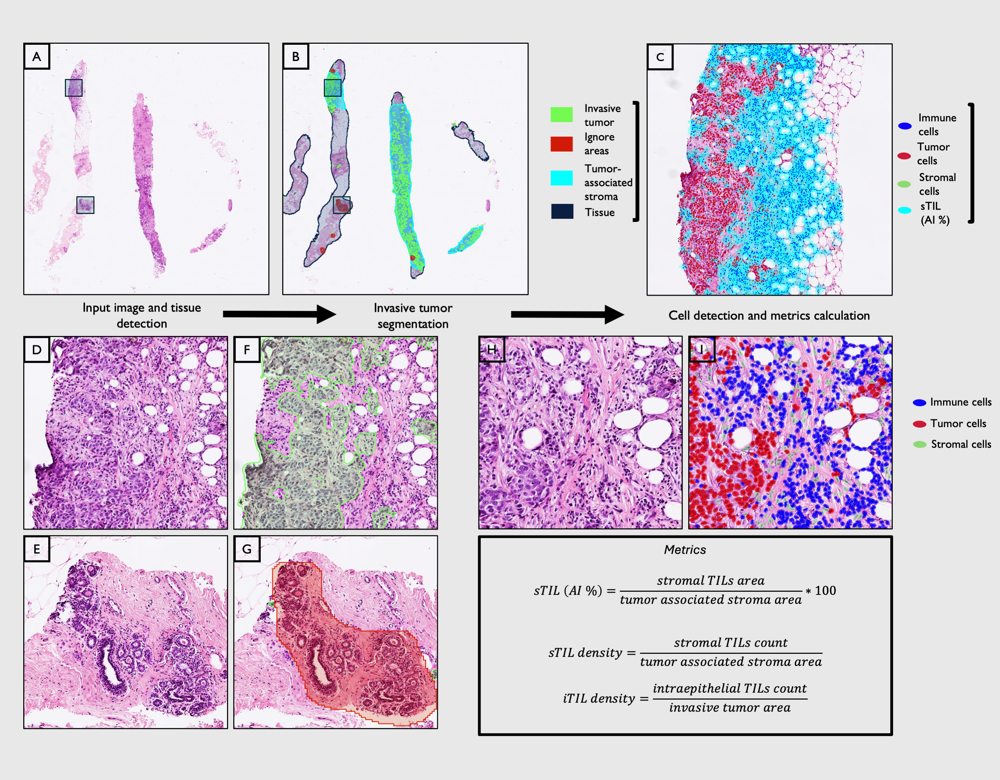

# TILs_in_NACT

This repository contains starter code for models used in TILs in NACT publication: 
Rasic, D., Stovgaard, E.I.S., Jylling, A.M.B. et al. AI assessment of tumor-infiltrating lymphocytes on routine H&E-slides as a predictor of response to neoadjuvant therapy in breast cancer—a real-world study. Virchows Arch (2025). https://doi.org/10.1007/s00428-025-04283-3

## License

This repository is licensed under the MIT License. See the [LICENSE](./LICENSE) file for details.

### Acknowledgements
This work uses:

- **Segmentation Models PyTorch** ([MIT License](https://github.com/qubvel/segmentation_models.pytorch/blob/master/LICENSE))
  Copyright (c) 2019-2021, Pavel Yakubovskiy
  
- **StarDist** ([BSD 3-Clause License](https://github.com/stardist/stardist/blob/master/LICENSE))
  Copyright (c) 2018-2024, Uwe Schmidt, Martin Weigert
  
Please refer to the respective licenses of these tools if you reuse or redistribute any parts of them in your own projects.
